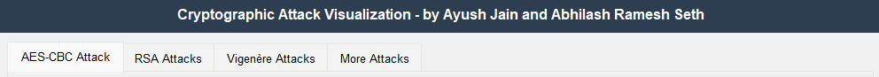
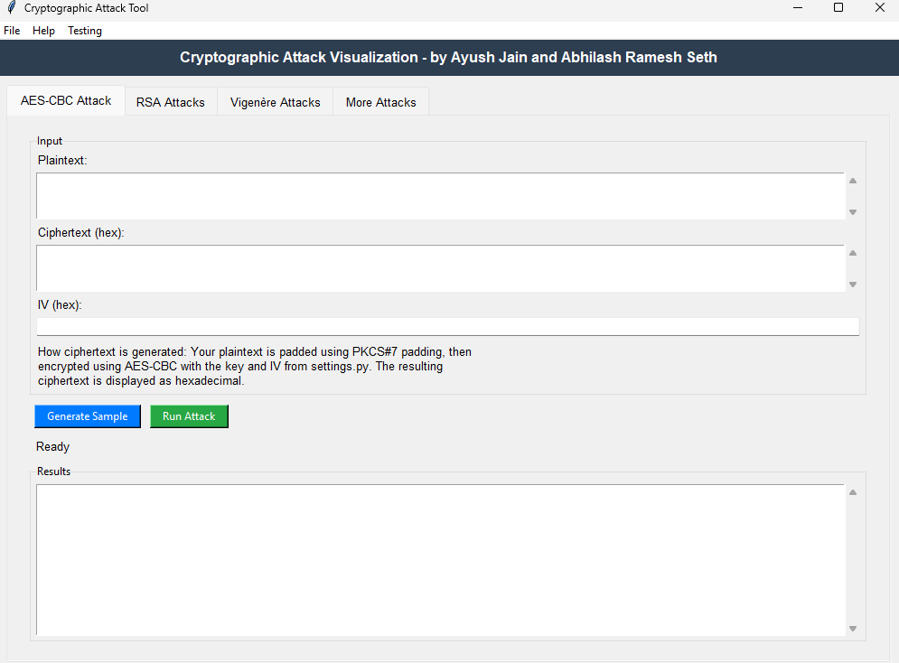
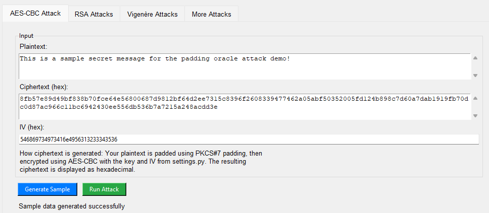
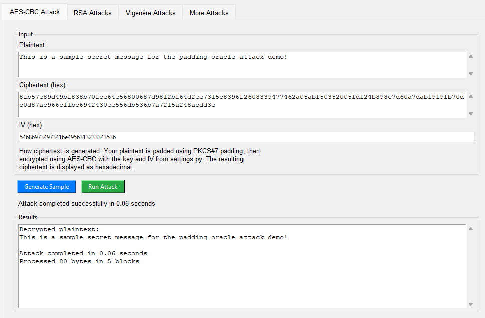
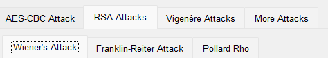
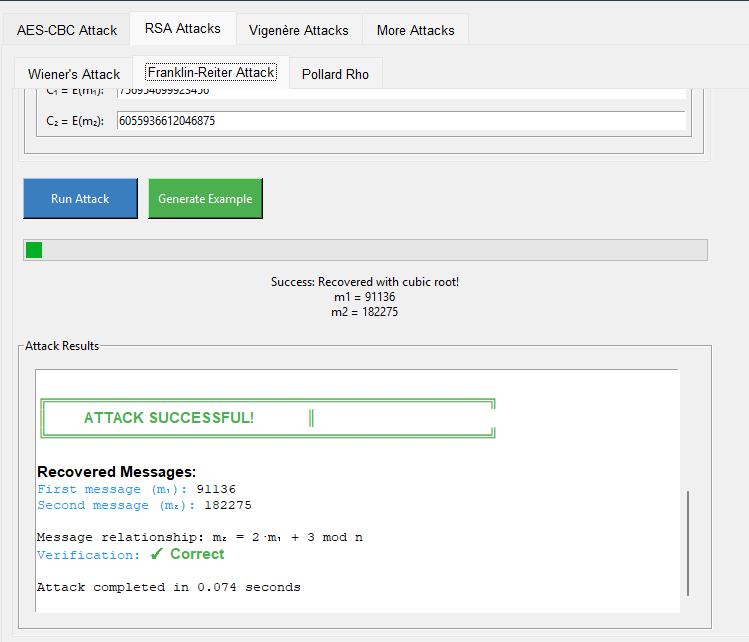
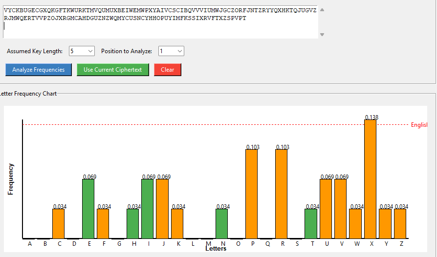
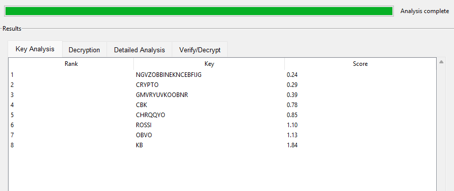
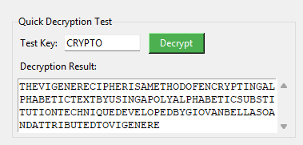

# Cryptographic Attack Tool



A comprehensive educational tool demonstrating practical cryptographic attacks with an interactive GUI interface. This application helps students, researchers, and security enthusiasts understand cryptographic vulnerabilities through practical demonstrations.

**⚠️ Educational Purpose Only**: This tool is developed strictly for educational and research purposes to understand cryptographic vulnerabilities.

## 📋 Table of Contents

- [Features](#features)
- [Installation](#installation)
- [Usage](#usage)
- [Cryptographic Attacks](#cryptographic-attacks)
  - [AES-CBC Padding Oracle Attack](#aes-cbc-padding-oracle-attack)
  - [RSA Attacks](#rsa-attacks)
  - [Vigenère Cipher Attacks](#vigenère-cipher-attacks)
- [Implementation Details](#implementation-details)
- [Visual Demonstrations](#visual-demonstrations)
- [Contributing](#contributing)
- [License](#license)

## ✨ Features

- **Interactive GUI**: User-friendly interface for configuring and executing attacks
- **Real-time Visualization**: See cryptographic attacks unfold step-by-step
- **Multiple Attack Vectors**: Comprehensive coverage of classic cryptographic vulnerabilities
- **Educational Explanations**: Learn the mathematical and cryptographic principles behind each attack
- **Customizable Parameters**: Configure attack parameters to understand different scenarios

## 🔧 Installation

### Prerequisites

- Python 3.7+
- Required packages: pycryptodome, sympy, tkinter (included with Python)

### Setup

1. Clone the repository:
```bash
git clone https://github.com/yourusername/crypto-attack-tool.git
cd crypto-attack-tool
```

2. Install dependencies:
```bash
pip install -r requirements.txt
```

3. Run the application:
```bash
python attack_tool.py
```

## 🚀 Usage

1. Launch the application using the command above
2. Select an attack type from the main menu
3. Configure the attack parameters according to your needs
4. Execute the attack and observe the results
5. Review the detailed explanation and steps performed

## 🔐 Cryptographic Attacks

### AES-CBC Padding Oracle Attack

The Padding Oracle Attack exploits vulnerabilities in the implementation of padding validation in AES-CBC mode encryption.

#### How It Works

1. **CBC Mode Basics**: In CBC mode, each plaintext block is XORed with the previous ciphertext block before encryption.
2. **Padding Vulnerability**: When decrypting, systems check if the padding is valid and may reveal this information through errors.
3. **The Attack**: By manipulating ciphertext blocks and observing padding validation responses, an attacker can gradually decrypt the message.

#### Tool Implementation

Our tool simulates a vulnerable server that leaks padding information and demonstrates the systematic decryption of ciphertext without knowing the key.

### RSA Attacks

#### Wiener's Attack

Targets RSA implementations with small private exponents.

**How It Works**:
- Uses continued fractions to find the private key when d is small relative to N
- Exploits the mathematical relationship between public and private keys
- Works when d < N^0.25

#### Franklin-Reiter Related Message Attack

Exploits when two related messages are encrypted with the same modulus.

**How It Works**:
- Requires two messages where one is linearly related to the other
- Uses polynomial greatest common divisor computations
- Recovers plaintext without factoring N or finding the private key

#### Pollard's Rho Algorithm

A factorization method that can break RSA when N has small prime factors.

**How It Works**:
- Uses a pseudorandom sequence to detect cycles
- Employs Floyd's cycle-finding algorithm
- Efficiently finds factors without brute force

### Vigenère Cipher Attacks

#### Kasiski Examination

A classic technique to break polyalphabetic substitution ciphers like Vigenère.

**How It Works**:
1. **Finding Repeated Sequences**: Identifies repeated text segments
2. **Key Length Determination**: Calculates distances between repetitions to determine possible key lengths
3. **Frequency Analysis**: Once the key length is known, individual Caesar ciphers can be analyzed
4. **Key Recovery**: Employing frequency analysis on each position to recover the key

## 💻 Implementation Details

The project is structured as follows:

- `attack_tool.py`: Main entry point
- `app/main_app.py`: Core GUI application
- `attacks/`: Individual implementations of each attack
  - `aes/`: AES-CBC Padding Oracle implementation
  - `rsa/`: RSA attack implementations
  - `vigenere/`: Vigenère cipher attack implementations
- `utils/`: Helper functions and utilities

## 📷 Visual Demonstrations

### Main Interface


*The main application interface showing all available attack options.*

### AES-CBC Padding Oracle Attack

 | 
:-------------------------:|:-------------------------:
*Configuration screen for the AES attack* | *Real-time visualization of the padding oracle attack*

### RSA Attacks

 | 
:-------------------------:|:-------------------------:
*Selection screen for different RSA attacks* | *Results showing recovered private key/plaintext*

### Vigenère Cipher Attacks

 |  | 
:-------------------------:|:-------------------------:|:-------------------------:
*Frequency analysis visualization* | *Key length determination process* | *Final decryption using the recovered key*

## 🤝 Contributing

Contributions are welcome! Please feel free to submit a Pull Request.

1. Fork the repository
2. Create your feature branch (`git checkout -b feature/amazing-feature`)
3. Commit your changes (`git commit -m 'Add some amazing feature'`)
4. Push to the branch (`git push origin feature/amazing-feature`)
5. Open a Pull Request

## 📝 License

This project is licensed under the MIT License - see the LICENSE file for details.

---

Created with ❤️ for educational purposes | © 2025
